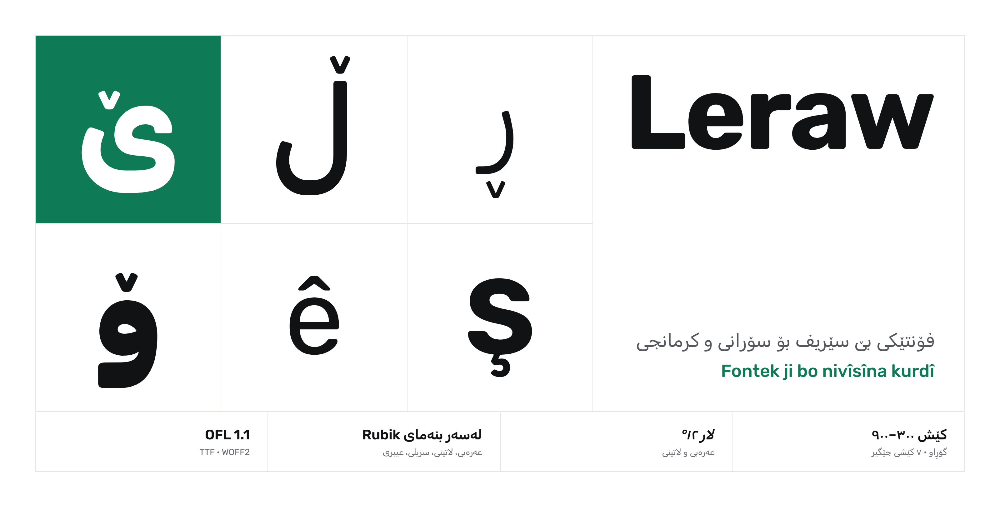
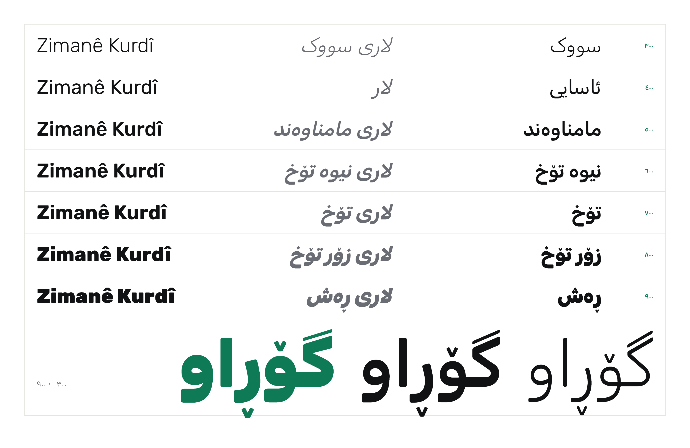
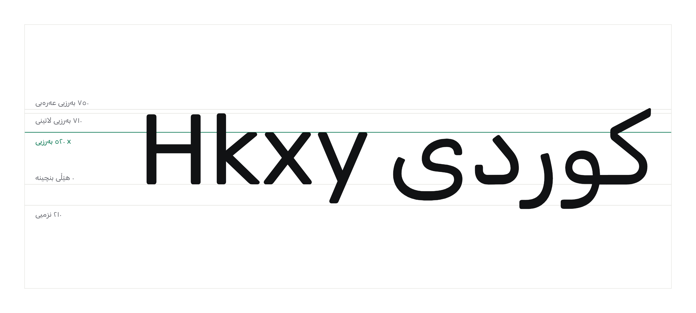
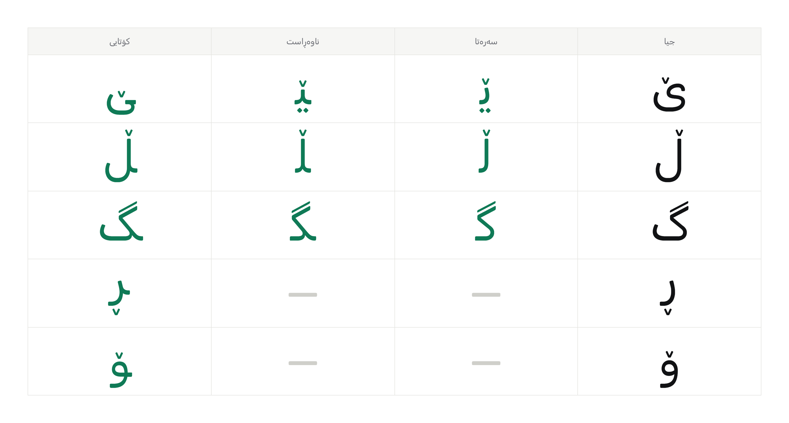
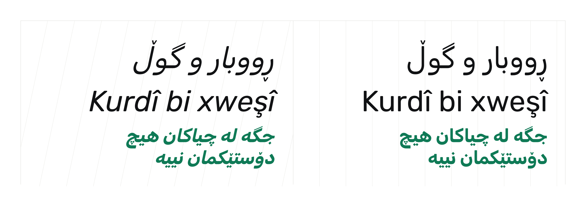
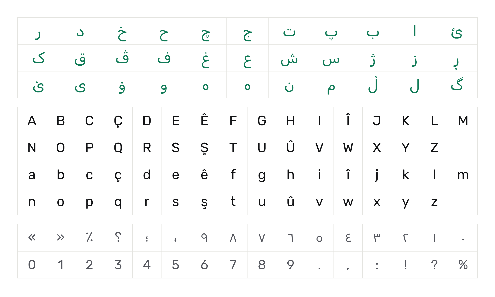

<div dir="rtl">

[English](README.md) · **کوردی**



# Leraw

Leraw فۆنتێکە بۆ نووسینی کوردی، بە سۆرانی و بە کرمانجی. لەسەر بنەمای Rubik ـە، کاری Hubert & Fischer، و ئەو پیتە سۆرانییانەی تێدا زیاد کراوە کە Rubik نەیبوون (ڕ ڵ ۆ ێ ە ھ). لە شێوەی لاردا عەرەبییەکە لەگەڵ لاتینییەکە لار کراوە.

حەوت کێشی هەیە، لە سووکەوە تا ڕەش، هەر کێشێکیش شێوەی لاری هەیە، لەگەڵ وەشانی گۆڕاوی هەردووکیان.

## دامەزراندن

فۆنتەکان لە [`fonts/`](fonts/) دان.

لە ویندۆز، فایلەکانی ناو `fonts/static` هەڵبژێرە، کلیکی ڕاست بکە و Install for all users هەڵبژێرە. لە مەک، بیانکەرەوە و کلیک لە Install Font بکە. لە لینوکس، بیانگوازەوە بۆ `‎~/.local/share/fonts` و `fc-cache -f` جێبەجێ بکە.

ئەگەر بەرنامەکەت فۆنتی گۆڕاو دەناسێت (Figma، بەرنامەکانی Adobe، هەر وێبگەڕێکی نوێ)، دەتوانیت دوو فایلەکەی ناو `fonts/variable` بەکاربهێنیت.

بۆ وێب:

<div dir="ltr">

```css
@font-face {
  font-family: "Leraw";
  src: url("Leraw[wght].woff2") format("woff2");
  font-weight: 300 900;
  font-style: normal;
}
@font-face {
  font-family: "Leraw";
  src: url("Leraw-Italic[wght].woff2") format("woff2");
  font-weight: 300 900;
  font-style: italic;
}
```

</div>

بۆ دەقی سۆرانی `dir="rtl" lang="ckb"` دابنێ و بۆ دەقی کرمانجی `lang="kmr"`.

## کێشەکان



| | ڕاست | لار |
|---|---|---|
| ٣٠٠ | سووک (Light) | لاری سووک (Light Italic) |
| ٤٠٠ | ئاسایی (Regular) | لار (Italic) |
| ٥٠٠ | مامناوەند (Medium) | لاری مامناوەند (Medium Italic) |
| ٦٠٠ | نیوە تۆخ (SemiBold) | لاری نیوە تۆخ (SemiBold Italic) |
| ٧٠٠ | تۆخ (Bold) | لاری تۆخ (Bold Italic) |
| ٨٠٠ | زۆر تۆخ (ExtraBold) | لاری زۆر تۆخ (ExtraBold Italic) |
| ٩٠٠ | ڕەش (Black) | لاری ڕەش (Black Italic) |

## پێوانەکان



em ـەکە ١٠٠٠ یەکەیە. بەرزیی x ٥٢٠ ـە، پیتە گەورەکان ٧٠٠، بەرزیی لاتینی دەگاتە ٧١٠ و عەرەبی ٧٥٠، و نزمییەکان تا ٢١٠ دادەبەزن.

## پیتە سۆرانییەکان


v ـی سەر ڕ ڵ ۆ ێ نیشانەیەکی جیایە و بۆ هەر پیتێک و هەر کێشێک جێگاکەی دیاری کراوە، بۆیە لە جێی خۆیدا دەمێنێتەوە، چ پیتەکە بە تەنیا بێت چ بە پیتەکانی دەوروبەری بلکێت.



## لار



لاتینی و عەرەبی هەردووکیان بە ١٢ پلە لار دەبن.

## لە بەکارهێناندا


## کۆی پیتەکان



## دروستکردن

سەرچاوەکان فایلە Glyphs ـەکانی ناو `sources/` ن: `Leraw.glyphs` بۆ ڕاست و `Leraw-Italic.glyphs` بۆ لار، هەر یەکەیان دوو ماستەری سووک و ڕەشی هەیە. لە Glyphs 3 دا دەکرێنەوە و بە [fontmake](https://github.com/googlefonts/fontmake) دروست دەکرێن. بۆ دروستکردنەوەی فۆنتەکان بە Python 3.10 یان نوێتر:

<div dir="ltr">

```bash
pip install -r requirements.txt
python build.py
```

</div>

فۆنتە گۆڕاوەکان لە `fonts/variable` و فۆنتە جێگیرەکان لە `fonts/static` دادەنرێن.

وێنەکانی ئەم README ـیە لە پەڕەکانی ناو [`showcase/`](showcase/) دروست دەکرێن، کە فۆنتەکانی `fonts/variable` بەکاردەهێنن. بۆ دروستکردنەوەیان دوای دروستکردنی فۆنتەکان:

<div dir="ltr">

```bash
pip install playwright
python -m playwright install chromium
python showcase/render.py
```

</div>

ناردنی تاگێکی وەک `v1.1` هەموو ئەمانە لە GitHub دەکات: فۆنتەکان بە وەشانی 1.100 دروست دەکرێن، وێنەکان دروست دەکرێنەوە، هەردووکیان لە لقی سەرەکیدا commit دەکرێن، و ڕیلیسێک لەگەڵ فایلێکی zip ـی فۆنتەکان بڵاو دەکرێتەوە.

## مۆڵەت

Leraw بەخۆڕاییە بۆ بەکارهێنان، بڵاوکردنەوە و گۆڕین، لە ژێر مۆڵەتی SIL Open Font License 1.1. دەقی تەواوی لە [OFL.txt](OFL.txt) دایە.

Copyright 2015 The Rubik Project Authors

Copyright 2026 Iolite

</div>
