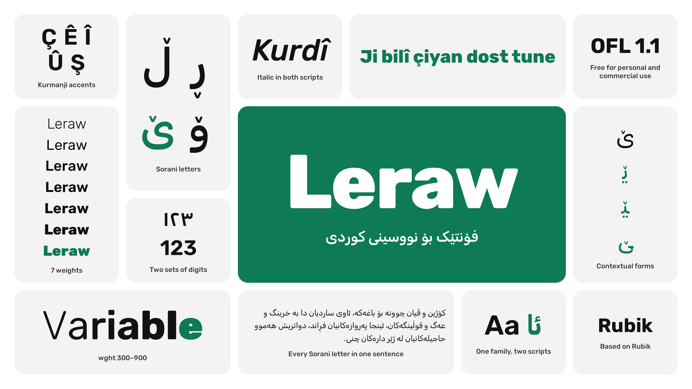
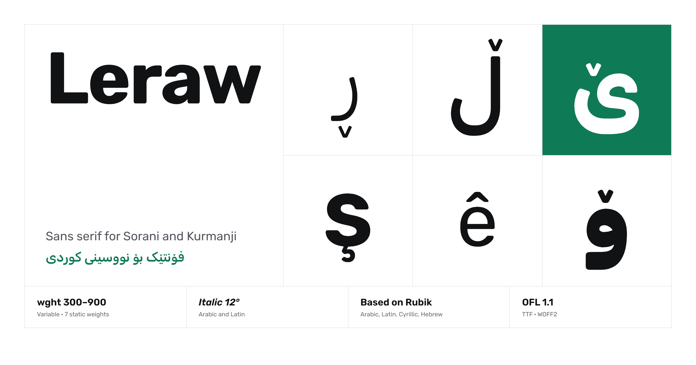
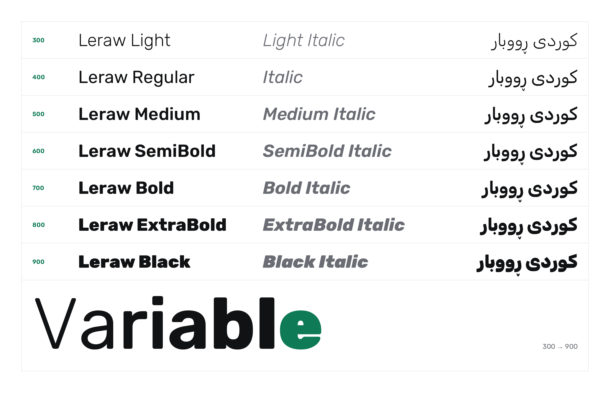
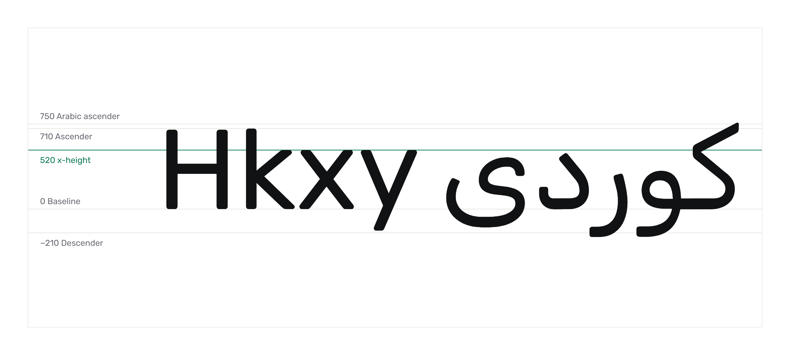
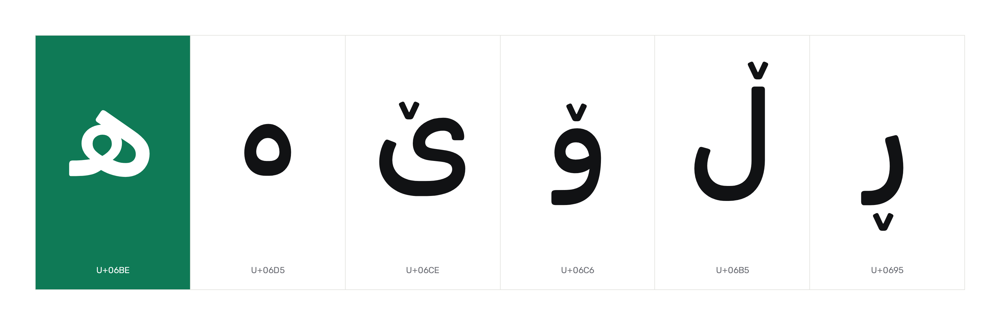
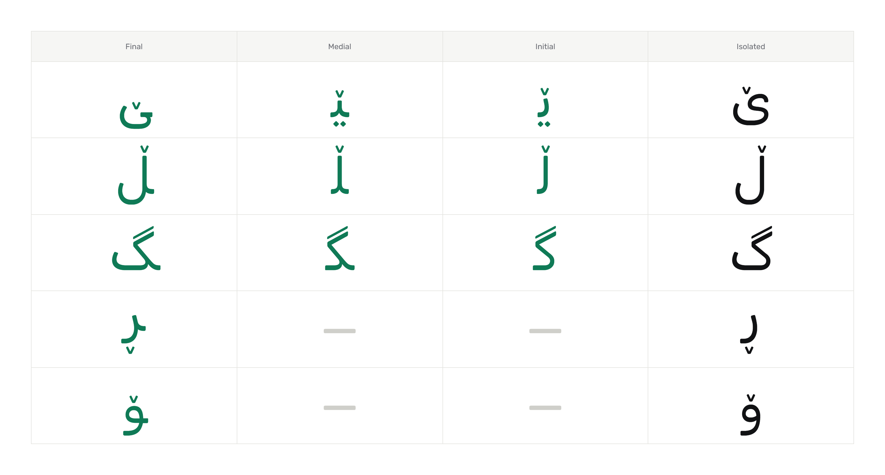
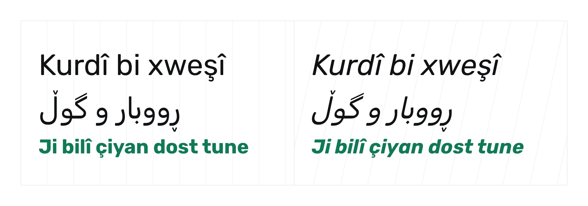
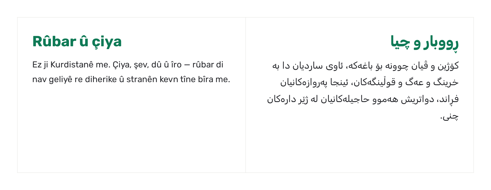
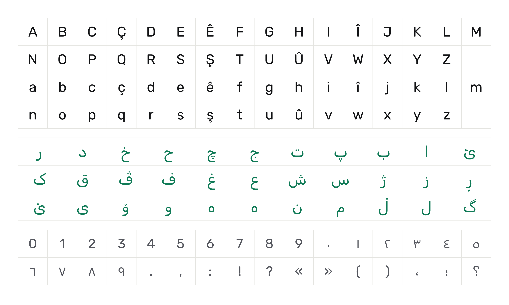

**English** · [کوردی](README.ckb.md)



# Leraw

Leraw is a typeface for writing Kurdish, in Sorani and in Kurmanji. It is based on Rubik by Hubert & Fischer, with the Sorani letters Rubik lacks (ڕ ڵ ۆ ێ ە ھ) added and the Arabic slanted along with the Latin in the italic.

There are seven weights from Light to Black, each with an italic, and variable versions of both.



## Install

The fonts are in [`fonts/`](fonts/).

On Windows, select the files in `fonts/static`, right-click and choose Install for all users. On a Mac, open them and click Install Font. On Linux, copy them to `~/.local/share/fonts` and run `fc-cache -f`.

If your app supports variable fonts (Figma, Adobe apps, any current browser), you can use the two files in `fonts/variable` instead.

On the web:

```css
@font-face {
  font-family: "Leraw";
  src: url("Leraw[wght].woff2") format("woff2");
  font-weight: 300 900;
  font-style: normal;
}
@font-face {
  font-family: "Leraw";
  src: url("Leraw-Italic[wght].woff2") format("woff2");
  font-weight: 300 900;
  font-style: italic;
}
```

Put `dir="rtl" lang="ckb"` on Sorani text and `lang="kmr"` on Kurmanji text.

## Weights



| | Upright | Italic |
|---|---|---|
| 300 | Light | Light Italic |
| 400 | Regular | Italic |
| 500 | Medium | Medium Italic |
| 600 | SemiBold | SemiBold Italic |
| 700 | Bold | Bold Italic |
| 800 | ExtraBold | ExtraBold Italic |
| 900 | Black | Black Italic |

## Metrics



The em is 1000 units. The x-height is 520, capitals are 700, ascenders reach 710 in Latin and 750 in Arabic, and descenders go down to 210.

## Sorani letters



The v on ڕ ڵ ۆ ێ is a separate mark, placed for each letter and each weight, so it stays where it belongs whether the letter stands alone or joins the letters around it.



## Italic



Latin and Arabic both slant at 12°.

## In use



## Character set



## Building

The sources are the Glyphs files in `sources/`: `Leraw.glyphs` for the upright and `Leraw-Italic.glyphs` for the italic, each with a Light and a Black master. They open in Glyphs 3 and build with [fontmake](https://github.com/googlefonts/fontmake). To rebuild the fonts with Python 3.10 or later:

```bash
pip install -r requirements.txt
python build.py
```

This writes the variable fonts to `fonts/variable` and the static fonts to `fonts/static`.

The images in this README are rendered from the pages in [`showcase/`](showcase/), which use the fonts in `fonts/variable`. To render them again after a build:

```bash
pip install playwright
python -m playwright install chromium
python showcase/render.py
```

Pushing a tag such as `v1.1` does all of this on GitHub: the fonts are built with version 1.100, the images are rendered, both are committed to the main branch, and a release is published with the fonts in a zip file.

## License

Leraw is free to use, share and change under the SIL Open Font License 1.1. The full text is in [OFL.txt](OFL.txt).

Copyright 2015 The Rubik Project Authors

Copyright 2026 Iolite
